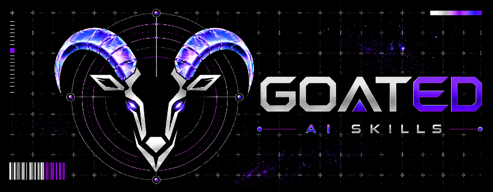

<p align="center">
  
</p>

# GOATED AI Skills

A compact operating system for serious AI agent work.

GOATED AI Skills is a open source library of installable, framework-agnostic AI skill folders. Copy the skills into Codex, Claude Code, Hermes, OpenCode, or another tool-calling agent workflow, then use them inside your own projects to onboard context, plan work, implement with discipline, review changes, sync docs, provide clean handoff points and more.

This is not a prompt dump. It is a reusable skill stack for people who want their agents to work with context, standards, proof, and a bias towards quality over quickly producing slop, whilst still taking advantage of the power of AI assisted engineering.

## Why This Exists

The typical agent workflow helps you ship code fast, and gets messy even faster.

One project has a good PRD prompt. Another has a review checklist. A third has a handoff habit, a context map, a test-driven development loop, or a way to keep docs from drifting. Most of that knowledge lives in scattered snippets, tool-specific setup, old chat history, or some private repo.

GOATED AI Skills packages those workflows as self-contained skill folders that can travel between agent frameworks and target projects. The goal is simple: give your agents a reliable set of skills for doing real work without forcing every project to reinvent the wheel. This allows you to easily switch between projects, whilst maintaining a consistent agentic AI assisted workflow, without spending hours setting it up from scratch every single time.

## Quick Start

1. Clone or download this repo.
2. Choose the skill folders you want from [`skills/`](skills/), or copy the full stack for the complete workflow.
3. Copy each selected folder intact into your agent framework's skill, command, prompt, or workflow location.
4. If you prefer, ask your AI agent to follow [`docs/install.md`](docs/install.md) and copy or install the skills for your framework.
5. Keep each skill's `SKILL.md` together with any local `references/`, `scripts/`, or `assets/`.
6. Add a short routing note to your agent instructions, such as `AGENTS.md`, `CLAUDE.md`, or another framework-specific adapter. Point it at the installed `using-goated-ai-skills` file, or at [`skills/agent-workflows/using-goated-ai-skills/SKILL.md`](skills/agent-workflows/using-goated-ai-skills/SKILL.md) if the agent will read from this cloned repo directly.
7. When the stack is installed, start with `using-goated-ai-skills` so your agent can route the request.

For install details, read [`docs/install.md`](docs/install.md). For the operator manual after installation, read [`docs/how-to-use.md`](docs/how-to-use.md).

V1 is docs-first. There is no installer script, automatic framework detection, runtime bootstrap, hook setup, or generated skill index in the current public core.

## What You Get

GOATED AI Skills helps agents move from "I can edit files and hope it's what you want" to "I can carry out work responsibly, with full knowledge of what you expect from me."

- **Progressive disclosure**: load the smallest useful context first, then go deeper only when the task needs it.
- **Target-project onboarding**: create durable project context, source maps, standards profiles, and thin agent instruction adapters.
- **Delivery workflows**: clarify intent, draft PRDs, break work into issues, plan architecture, prototype ideas, and write implementation plans.
- **Implementation discipline**: use test-driven development, focused diagnosis, subagent-aware execution, standards review, security review, doc sync, and verification before completion claims.
- **Clean continuity**: write commit messages and handoffs that help the next session resume with clarity.
- **Portable skill design**: keep installed skills self-contained so they do not depend on this repo's root files at runtime.

## The Three-Layer Model

GOATED AI Skills keeps three contexts separate on purpose.

### 1. Skill Pack Distribution

This repository is the public distribution home for reusable skill folders. Users clone, download, copy, install, or adapt skills from here into their chosen agent framework.

### 2. Target Project Onboarding

Installed skills prepare a user's actual project for durable agent work. Onboarding can map sources, define project language, capture standards, integrate agent instructions, and create architecture context when useful.

### 3. Target Project Delivery

Installed skills help move one real change through the work cycle: clarify, plan, implement, test, review, document, verify, commit, and hand off.

Tiny one-off tasks can still stay tiny. The stack is there when the work is cross-file, public-facing, architectural, repeated, or standards-sensitive.

## Skill Catalog

The V1 public core is complete, and all current public-core skills are portable, implemented, and self-contained. The implemented skills still intentionally declare `status: wip` while the workflows are sharpened.

### Agent Workflows

- [`using-goated-ai-skills`](skills/agent-workflows/using-goated-ai-skills/SKILL.md): classify the request and choose the next GOATED skill or direct-action path.
- [`session-start-progressive-disclosure`](skills/agent-workflows/session-start-progressive-disclosure/SKILL.md): start sessions by loading only the context that matters.
- [`context-matrix-map`](skills/agent-workflows/context-matrix-map/SKILL.md): create a durable source map that tells future agents what to read first, second, and only if needed.
- [`project-context-calibration`](skills/agent-workflows/project-context-calibration/SKILL.md): create or refresh durable project context, including boundaries, language, artifacts, and architecture vocabulary.
- [`project-standards-calibration`](skills/agent-workflows/project-standards-calibration/SKILL.md): separate documented standards, inferred conventions, preferences, and unresolved questions.
- [`agent-instructions-integrator`](skills/agent-workflows/agent-instructions-integrator/SKILL.md): connect installed skills to a target project's thin agent instruction layer.
- [`framework-agnostic-skill-creator`](skills/agent-workflows/framework-agnostic-skill-creator/SKILL.md): create, port, adapt, and sanitize skills into the GOATED shape.
- [`handoff`](skills/agent-workflows/handoff/SKILL.md): preserve continuity for future agents or future sessions.

### Engineering

- [`grill-with-docs`](skills/engineering/grill-with-docs/SKILL.md): clarify, brainstorm options, and pressure-test important work against project docs, standards, and source facts before implementation.
- [`diagnose`](skills/engineering/diagnose/SKILL.md): investigate bugs, failing tests, build failures, regressions, and unexpected behavior before fixing them.
- [`write-a-prd`](skills/engineering/write-a-prd/SKILL.md): turn fuzzy intent into a scoped product requirements document.
- [`prd-to-issues`](skills/engineering/prd-to-issues/SKILL.md): break a PRD or approved plan into implementation-ready issue handoffs.
- [`writing-plans`](skills/engineering/writing-plans/SKILL.md): produce just-in-time implementation plans with evidence, gates, and stop conditions.
- [`plan-codebase-architecture`](skills/engineering/plan-codebase-architecture/SKILL.md): design source-grounded modules, interfaces, seams, test surfaces, and slice order.
- [`architecture-design-map`](skills/engineering/architecture-design-map/SKILL.md): create source-grounded architecture maps, flow maps, and quick zoom-outs.
- [`improve-codebase-architecture`](skills/engineering/improve-codebase-architecture/SKILL.md): find refactor opportunities that make code easier to understand and test.
- [`prototype`](skills/engineering/prototype/SKILL.md): explore one product, UI, workflow, data, or technical idea with disposable, runnable evidence.
- [`tdd`](skills/engineering/tdd/SKILL.md): use test-driven development to drive behavior changes through red, green, and refactor.
- [`subagent-driven-development`](skills/engineering/subagent-driven-development/SKILL.md): coordinate bounded implementer and reviewer agents while one main agent owns integration.
- [`receiving-code-review`](skills/engineering/receiving-code-review/SKILL.md): handle review feedback without blindly accepting or dismissing it.
- [`standards-and-spec-review`](skills/engineering/standards-and-spec-review/SKILL.md): review changes against project standards and the originating spec as separate axes.
- [`code-security-review`](skills/engineering/code-security-review/SKILL.md): inspect risky diffs and trust boundaries for high-evidence security issues.
- [`doc-sync`](skills/engineering/doc-sync/SKILL.md): keep docs aligned with changed behavior, interfaces, architecture, tests, and workflows.
- [`verification-before-completion`](skills/engineering/verification-before-completion/SKILL.md): require fresh evidence before claiming work is done, correct, synced, or ready.
- [`commit-message`](skills/engineering/commit-message/SKILL.md): draft concise, information-rich commit messages from local diffs and checks.

### Productivity

- [`grill-me`](skills/productivity/grill-me/SKILL.md): challenge and clarify ideas, plans, choices, and decisions when project docs are not needed.
- [`caveman`](skills/productivity/caveman/SKILL.md): keep replies compact without losing important warnings, uncertainty, or exactness.

## Typical Routes

Use these as human-readable maps. Installed agents should still begin with `using-goated-ai-skills` so user and project instructions can choose the right path.

### Onboard a Target Project

```text
session-start-progressive-disclosure
-> grill-with-docs
-> context-matrix-map
-> project-context-calibration
-> project-standards-calibration
-> agent-instructions-integrator
-> architecture-design-map optional
-> plan-codebase-architecture optional
-> doc-sync
-> handoff optional
```

### Deliver a Real Change

```text
session-start-progressive-disclosure
-> grill-with-docs when gated mandatory
-> prototype optional
-> write-a-prd
-> plan-codebase-architecture optional
-> prd-to-issues
-> prototype optional per focused issue
-> writing-plans
-> subagent-driven-development optional
-> tdd
-> standards-and-spec-review
-> code-security-review
-> doc-sync
-> verification-before-completion
-> commit-message
-> handoff optional
```

## Source Repo, Installed Skills, Target Projects

This repo is the source library and maintainer workspace for GOATED AI Skills. It is not a project template that users are expected to clone into every codebase.

Once copied into an agent framework, each installed skill folder must carry the guidance it needs inside its own folder. Installed skills should not require this repo's root [`AGENT.md`](AGENT.md), [`README.md`](README.md), or [`CONTEXT.md`](CONTEXT.md) at runtime.

Target projects are the user's downstream projects where installed skills do the work: onboarding, planning, architecture, implementation, review, docs, and handoff.

## Repo Map

```text
AGENT.md               Maintainer and contributor guidance for this source repo.
AGENTS.md              Thin adapter for agents contributing to this repo.
CLAUDE.md              Thin adapter for Claude-style contributors to this repo.
CONTEXT.md             Public context and domain language for GOATED AI Skills.
docs/install.md        Docs-first installation and adaptation guidance.
docs/how-to-use.md     Human operator manual for the installed skill stack.
docs/adr/              Architectural decision records.
docs/assets/           Public README and documentation assets.
skills/                Public skill categories and implemented skill folders.
issues/                PRDs and archived implementation issue handoffs.
```

## Public Boundary

Public main is for portable public-core workflows. It should not depend on private notes, private project names, credentials, client data, handles, sensitive personal domains, or private workflow assumptions.

Private forks or private deployments can add private or domain-specific skills using the same conventions, then sanitize anything intended for public contribution later.

## Inspiration

Some GOATED AI Skills were inspired by ideas from two public agent-skill projects:

- [`mattpocock/skills`](https://github.com/mattpocock/skills), especially its practical, composable approach to engineering-focused agent skills.
- [`obra/superpowers`](https://github.com/obra/superpowers), especially its agentic software-development methodology, verification discipline, and skill-driven workflow model.

GOATED AI Skills is an independent, framework-agnostic library that adapts those inspirations into its own portable approach to serious agent work. Each skill folder is meant to be self-contained enough to copy, adapt, and use on its own, while the full stack is carefully designed to work together as a cohesive workflow across onboarding, delivery, review, documentation, and handoff.

## Maintainer Notes

GOATED AI Skills is currently led and curated by its creator. Ideas, questions, and thoughtful feedback are welcome, but this repo is not accepting unsolicited pull requests right now.


For suggestions, please use GitHub Discussions. That keeps the project open to outside input while leaving implementation, scope, and quality decisions with the maintainer.

If you want to understand the project model before suggesting a change, read [`CONTEXT.md`](CONTEXT.md), [`docs/install.md`](docs/install.md), and [`docs/how-to-use.md`](docs/how-to-use.md). For skill schema and category conventions, read [`skills/README.md`](skills/README.md).

Maintainer-approved work may be tracked separately when an idea is ready to become scoped repo work.
