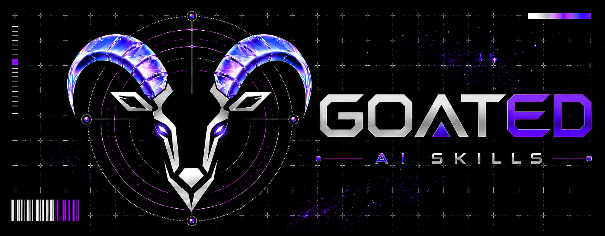

<p align="center">
  
</p>

# GOATED AI Skills

A compact operating system for serious AI agent work.

GOATED AI Skills is an open source library of installable, framework-agnostic
AI skill folders. V2 adds a shared integrated-stack policy and validated
catalog while preserving the ability to copy one skill.

This is not a prompt dump. It is a reusable skill stack for people who want their agents to work with context, standards, proof, and a bias towards quality over quickly producing slop, whilst still taking advantage of the power of AI assisted engineering.

## Why This Exists

The typical agent workflow helps you ship code fast, and gets messy even faster.

One project has a good PRD prompt. Another has a review checklist. A third has a handoff habit, a context map, a test-driven development loop, or a way to keep docs from drifting. Most of that knowledge lives in scattered snippets, tool-specific setup, old chat history, or some private repo.

GOATED AI Skills packages those workflows as self-contained skill folders that can travel between agent frameworks and target projects. The goal is simple: give your agents a reliable set of skills for doing real work without forcing every project to reinvent the wheel. This allows you to easily switch between projects, whilst maintaining a consistent agentic AI assisted workflow, without spending hours setting it up from scratch every single time.

## Quick Start

1. Clone or download this repo.
2. For the recommended integrated mode, choose skill folders from
   [`skills/`](skills/) and copy the shared files under [`stack/`](stack/).
3. Merge `stack/AGENTS.md` into the instruction artifact your framework
   applies, and keep the registry, schema, and templates together.
4. For individual mode, copy one complete skill folder without the shared
   stack files.
5. Follow [`docs/install.md`](docs/install.md) for both walkthroughs.

For install details, read [`docs/install.md`](docs/install.md). For the operator manual after installation, read [`docs/how-to-use.md`](docs/how-to-use.md).

The V2 foundation remains docs-first. There is no installer script, automatic
framework detection, runtime bootstrap, hook setup, or executable
orchestration.

## What You Get

GOATED AI Skills helps agents move from "I can edit files and hope it's what you want" to "I can carry out work responsibly, with full knowledge of what you expect from me."

- **Progressive disclosure**: load the smallest useful context first, then go deeper only when the task needs it.
- **Target-project onboarding**: select a lightweight, standard, or full
  artifact budget from one discovery pass, then create or incrementally refresh
  only the context, source-map, standards, architecture, and routing artifacts
  that solve a demonstrated need.
- **Delivery workflows**: clarify intent, draft PRDs, break work into issues, plan architecture, prototype ideas, and write implementation plans.
- **Implementation discipline**: use test-driven development, focused diagnosis, subagent-aware execution, scoped code refinement, standards review, security review, documentation cleanup, doc sync, and verification before completion claims.
- **Clean continuity**: write commit messages and handoffs that help the next session resume with clarity.
- **Two portable install modes**: share universal behavior in integrated mode
  while keeping compact standalone fallbacks for individual skills.

## The Three-Layer Model

GOATED AI Skills keeps three contexts separate on purpose.

### 1. Skill Pack Distribution

This repository is the public distribution home for reusable skill folders. Users clone, download, copy, install, or adapt skills from here into their chosen agent framework.

### 2. Target Project Onboarding

Installed skills prepare a user's actual project for durable agent work. Onboarding can map sources, define project language, capture standards, preserve concise external-doc lookup notes when external documentation materially informs work, integrate agent instructions, capture project-level product scope, roadmap intent, or acceptance criteria in `docs/specs/` when needed, and create architecture context when useful.

### 3. Target Project Delivery

Installed skills help move one real change through the work cycle: clarify, plan, implement, test, review, document, verify, commit, and hand off.

Tiny one-off tasks can still stay tiny. The stack is there when the work is cross-file, public-facing, architectural, repeated, or standards-sensitive.

## Skill Catalog

The V1 public core is preserved at the `v1-baseline` Git tag. The active V2
migration begins with the shared policy, registry, schema, and templates under
`stack/`.

### Agent Workflows

- [`using-goated-ai-skills`](skills/agent-workflows/using-goated-ai-skills/SKILL.md): classify the request and choose the next GOATED skill or direct-action path.
- [`session-start-progressive-disclosure`](skills/agent-workflows/session-start-progressive-disclosure/SKILL.md): start sessions by loading only the context that matters.
- [`context-matrix-map`](skills/agent-workflows/context-matrix-map/SKILL.md): create a durable source map that tells future agents what to read first, second, and only if needed, including optional external-doc lookup notes when present.
- [`project-context-calibration`](skills/agent-workflows/project-context-calibration/SKILL.md): create or refresh durable project context, including boundaries, language, artifacts, and architecture vocabulary.
- [`project-standards-calibration`](skills/agent-workflows/project-standards-calibration/SKILL.md): separate documented standards, inferred conventions, preferences, and unresolved questions.
- [`agent-instructions-integrator`](skills/agent-workflows/agent-instructions-integrator/SKILL.md): connect installed skills to a target project's thin agent instruction layer.
- [`framework-agnostic-skill-creator`](skills/agent-workflows/framework-agnostic-skill-creator/SKILL.md): create, port, adapt, and sanitize skills into the GOATED shape.
- [`handoff`](skills/agent-workflows/handoff/SKILL.md): preserve continuity for future agents or future sessions.

### Engineering

- [`grill-with-docs`](skills/engineering/grill-with-docs/SKILL.md): clarify, brainstorm options, and pressure-test important work against project docs, standards, and source facts before implementation.
- [`diagnose`](skills/engineering/diagnose/SKILL.md): investigate bugs, failing tests, build failures, regressions, and unexpected behavior before fixing them.
- [`write-a-spec`](skills/engineering/write-a-spec/SKILL.md): turn fuzzy intent into a proportionate compact or full spec.
- [`spec-to-tickets`](skills/engineering/spec-to-tickets/SKILL.md): break an approved spec into dependency-aware delivery tickets and a local order file for multi-ticket sets.

The integrated registry resolves the V1 names `write-a-prd` and
`prd-to-issues` as aliases for these canonical skills. Individual installs copy
only the canonical folders.
- [`writing-plans`](skills/engineering/writing-plans/SKILL.md): produce just-in-time implementation plans with evidence, gates, and stop conditions.
- [`design-codebase-architecture`](skills/engineering/design-codebase-architecture/SKILL.md): design source-grounded modules, interfaces, seams, test surfaces, and slice order.
- [`architecture-design-map`](skills/engineering/architecture-design-map/SKILL.md): create source-grounded architecture maps, flow maps, and quick zoom-outs.
- [`review-codebase-architecture`](skills/engineering/review-codebase-architecture/SKILL.md): review refactor opportunities that could make code easier to understand and test.
- [`prototype`](skills/engineering/prototype/SKILL.md): explore one product, UI, workflow, data, or technical idea with disposable, runnable evidence.
- [`tdd`](skills/engineering/tdd/SKILL.md): use test-driven development to drive behavior changes through red, green, and refactor.
- [`code-refinement`](skills/engineering/code-refinement/SKILL.md): refine recently changed code after implementation while preserving behavior and avoiding unrelated churn; for non-trivial code-producing work, run it or explicitly record why it was skipped.
- [`subagent-driven-development`](skills/engineering/subagent-driven-development/SKILL.md): coordinate bounded implementer and reviewer agents while one main agent owns integration.
- [`receiving-code-review`](skills/engineering/receiving-code-review/SKILL.md): handle review feedback without blindly accepting or dismissing it.
- [`standards-and-spec-review`](skills/engineering/standards-and-spec-review/SKILL.md): review changes against project standards and the originating spec as separate axes.
- [`code-security-review`](skills/engineering/code-security-review/SKILL.md): inspect risky diffs and trust boundaries for high-evidence security issues.
- [`documentation-writer`](skills/engineering/documentation-writer/SKILL.md): create source-grounded durable manuals, guides, runbooks, product docs, and AI-facing guide docs.
- [`documentation-cleanup`](skills/engineering/documentation-cleanup/SKILL.md): audit and tidy docs trees, root routing docs, progress/status docs, and agent-facing docs through a role-aware, gated cleanup workflow.
- [`doc-sync`](skills/engineering/doc-sync/SKILL.md): keep docs aligned with changed behavior, interfaces, architecture, tests, and workflows.
- [`verification-before-completion`](skills/engineering/verification-before-completion/SKILL.md): require fresh evidence before claiming work is done, correct, synced, or ready.
- [`commit-message`](skills/engineering/commit-message/SKILL.md): draft concise, information-rich commit messages from local diffs and checks.

### Productivity

- [`goated-prompt`](skills/productivity/goated-prompt/SKILL.md): transform rough requests into GOATED-aware prompts or portable reusable prompts with calibrated context and prompt type.
- [`grill-me`](skills/productivity/grill-me/SKILL.md): challenge and clarify ideas, plans, choices, and decisions when project docs are not needed.
- [`learning-capture`](skills/productivity/learning-capture/SKILL.md): capture durable lessons, extract reusable knowledge from provided material, and nurture atomic knowledge notes.
- [`caveman`](skills/productivity/caveman/SKILL.md): keep replies compact without losing important warnings, uncertainty, or exactness.

## Typical Routes

Use these as human-readable maps. Installed agents should still begin with `using-goated-ai-skills` so user and project instructions can choose the right path.

### Onboard a Target Project

```text
using-goated-ai-skills
-> proportional discovery and artifact budget
-> agent-instructions-integrator for thin policy/routing
-> context-matrix-map optional for retrieval gaps
-> project-context-calibration optional for terminology/boundary gaps
-> project-standards-calibration optional for standards gaps
-> architecture or product artifacts only when discovery justifies them
-> handoff optional for resumable work
```

### Deliver a Real Change

```text
session-start-progressive-disclosure
-> grill-with-docs when gated mandatory
-> prototype optional
-> write-a-spec
-> design-codebase-architecture optional
-> spec-to-tickets
-> prototype optional per focused issue
-> writing-plans
-> subagent-driven-development optional
-> tdd
-> code-refinement run-or-explicit-skip for non-trivial code changes
-> standards-and-spec-review
-> code-security-review
-> documentation-writer optional when planned docs are part of scope
-> documentation-cleanup optional when docs structure or agent docs need broader hygiene
-> doc-sync
-> verification-before-completion
-> commit-message
-> handoff optional
```

### Craft or Refine a Prompt

```text
using-goated-ai-skills when the route is unclear
-> goated-prompt
-> grill-me optional when lightweight intent clarity is needed
-> grill-with-docs optional when project evidence or standards matter
```

## Source Repo, Installed Skills, Target Projects

This repo is the source library and maintainer workspace for GOATED AI Skills. It is not a project template that users are expected to clone into every codebase.

An individually copied skill must retain enough task-critical guidance to work
without the integrated registry or this repo's root [`AGENT.md`](AGENT.md),
[`README.md`](README.md), or [`CONTEXT.md`](CONTEXT.md). Integrated installs
share universal behavior through `stack/AGENTS.md`.

Target projects are the user's downstream projects where installed skills do the work: onboarding, planning, architecture, implementation, review, docs, and handoff.

## Repo Map

```text
AGENT.md               Maintainer and contributor guidance for this source repo.
AGENTS.md              Thin adapter for agents contributing to this repo.
CLAUDE.md              Thin adapter for Claude-style contributors to this repo.
CONTEXT.md             Public context and domain language for GOATED AI Skills.
pyproject.toml         Local uv tooling configuration for maintainer checks.
uv.lock                Locked Python tooling dependencies.
scripts/               Source-repo maintenance scripts, including skill validation.
docs/install.md        Docs-first installation and adaptation guidance.
docs/how-to-use.md     Human operator manual for the installed skill stack.
stack/                 V2 shared policy, registry, schema, and state templates.
docs/adr/              Architectural decision records.
docs/assets/           Public README and documentation assets.
skills/                Public skill categories and implemented skill folders.
docs/specs/            Active product and delivery specs.
tickets/               Active dependency-aware delivery tickets.
issues/                Historical V1 PRDs and archived issue handoffs.
```

## Public Boundary

Public main is for portable public-core workflows. It should not depend on private notes, private project names, credentials, client data, handles, sensitive personal domains, or private workflow assumptions.

Private forks or private deployments can add private or domain-specific skills using the same conventions, then sanitize anything intended for public contribution later.

## Inspiration

Some GOATED AI Skills were inspired by ideas from two public agent-skill projects:

- [`mattpocock/skills`](https://github.com/mattpocock/skills), especially its practical, composable approach to engineering-focused agent skills.
- [`obra/superpowers`](https://github.com/obra/superpowers), especially its agentic software-development methodology, verification discipline, and skill-driven workflow model.

GOATED AI Skills is an independent, framework-agnostic library that adapts those inspirations into its own portable approach to serious agent work. Each skill folder is meant to be self-contained enough to copy, adapt, and use on its own, while the full stack is carefully designed to work together as a cohesive workflow across onboarding, delivery, review, documentation, and handoff.

## Maintainer Notes

GOATED AI Skills is currently led and curated by its creator. Ideas, questions, and thoughtful feedback are welcome, but this repo is not accepting unsolicited pull requests right now.


For suggestions, please use GitHub Discussions. That keeps the project open to outside input while leaving implementation, scope, and quality decisions with the maintainer.

If you want to understand the project model before suggesting a change, read [`CONTEXT.md`](CONTEXT.md), [`docs/install.md`](docs/install.md), and [`docs/how-to-use.md`](docs/how-to-use.md). For skill schema and category conventions, read [`skills/README.md`](skills/README.md).

Maintainer-approved work may be tracked separately when an idea is ready to become scoped repo work.
