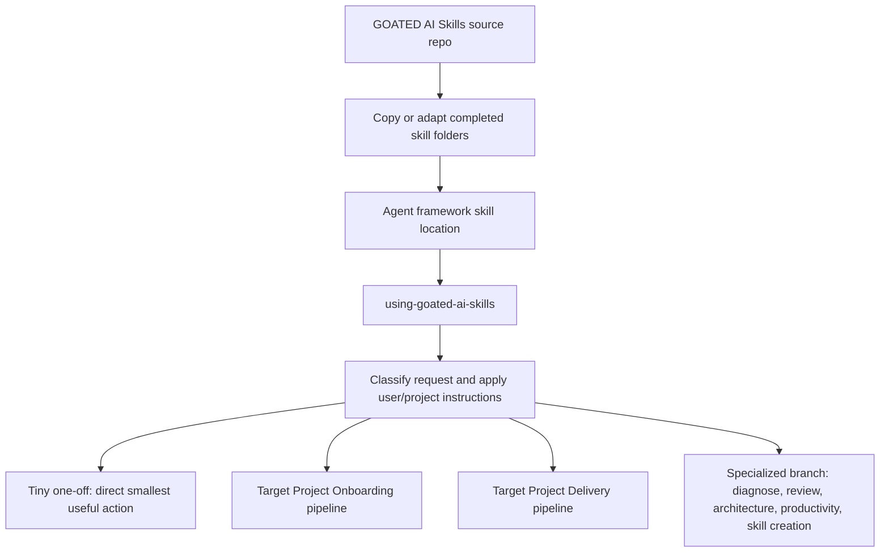

# How To Use GOATED AI Skills

This is the user guide for running GOATED AI Skills after you have copied, installed, or adapted the skill folders into an agent framework.

For installation mechanics, start with [install.md](install.md). This guide picks up after that: how to route work, how the two main pipelines fit together, and what each skill contributes.

## Mental Model

GOATED AI Skills has three distinct contexts:

- **Source repo**: the GOATED AI Skills public repository, where reusable skill folders are published and maintained.
- **Installed skills**: copied skill folders inside an agent framework such as Codex, Claude Code, Hermes, OpenCode, or another tool-calling environment.
- **Target project**: the user's actual project where installed skills help with onboarding, planning, implementation, review, documentation, and handoff.

Do not treat the GOATED AI Skills repository as a project template. The normal V1 path is docs-first: copy or adapt completed skill folders into your agent framework, keep each skill folder intact, and let the installed skills operate inside your target project.

Current V1 notes:

- All implemented skills currently declare `status: wip`.
- Installed skills should remain self-contained after copying.
- Runtime bootstrap, automatic activation, generated plugin manifests, hook setup, installer scripts, and framework detection automation are out of scope for V1.
- Tiny one-off tasks can skip the full workflow when the request is small, obvious, and low risk.

## The Full Stack

The stack has three layers:

1. **Skill Pack Distribution**: clone, download, copy, install, or adapt the skill folders into your chosen agent framework.
2. **Target Project Onboarding**: prepare a target project for durable, repeated, cross-file, PRD-level, architectural, or public-facing work.
3. **Target Project Delivery**: move one target-project change from intent through planning, implementation, review, documentation, verification, and handoff.

Use `using-goated-ai-skills` as the router when you or your agent are unsure which path applies.



## Pipeline 1: Target Project Onboarding

Run onboarding before serious or repeated work in a target project. The purpose is to help future agents know what to read, what the project means by its terms, which standards apply, and how installed skills should be routed.

```mermaid
flowchart LR
  A["session-start-progressive-disclosure"] --> B["grill-with-docs"]
  B --> C["context-matrix-map"]
  C --> D["project-context-calibration"]
  D --> E["project-standards-calibration"]
  E --> F["agent-instructions-integrator"]
  F --> G["architecture-design-map optional"]
  G --> H["plan-codebase-architecture optional"]
  H --> I["doc-sync"]
  I --> J["handoff optional"]
```



Typical flow:

1. Start small with `session-start-progressive-disclosure` so the agent reads only the context needed for the request.
2. Use `grill-with-docs` to clarify goals, success criteria, terminology, and scope against existing project facts.
3. Create durable context artifacts with `context-matrix-map`, `project-context-calibration`, and `project-standards-calibration`.
4. Use `agent-instructions-integrator` to connect the target project's agent instructions to installed skills and durable artifacts.
5. Add `architecture-design-map` or `plan-codebase-architecture` only when the project needs architecture orientation or a project-wide blueprint.
6. Run `doc-sync` and optional `handoff` so the onboarding result is discoverable later.

Expected durable target-project artifacts often include:

- `CONTEXT.md`
- `docs/agents/context-matrix.md`
- `docs/agents/project-standards.md`
- `docs/agents/architecture-plan.md` when a project-wide architecture blueprint is useful
- OS temp handoffs under `goated-handoffs/<project-name>/` when continuity is needed but a tracked file is not

## Pipeline 2: Target Project Delivery

Run delivery when you want to make a real change in a target project. For serious work, delivery assumes onboarding has already happened or starts by gathering the missing context.

```mermaid
flowchart LR
  A["session-start-progressive-disclosure"] --> B["grill-with-docs when gated mandatory"]
  B --> C["prototype optional"]
  C --> D["write-a-prd"]
  D --> E["plan-codebase-architecture optional"]
  E --> F["prd-to-issues"]
  F --> G["prototype optional per focused issue"]
  G --> H["writing-plans"]
  H --> I["subagent-driven-development optional"]
  I --> J["tdd"]
  J --> K["standards-and-spec-review"]
  K --> L["code-security-review"]
  L --> M["doc-sync"]
  M --> N["verification-before-completion"]
  N --> O["commit-message"]
  O --> P["handoff optional"]
```



Typical flow:

1. Use `session-start-progressive-disclosure` to gather just enough context.
2. Use `grill-with-docs` when the work is unclear, architectural, public-facing, cross-file, standards-sensitive, or PRD-level.
3. Use `prototype` before committing to a risky product, UI, logic, or technical choice.
4. Use `write-a-prd` for fuzzy ideas, then `prd-to-issues` to break the PRD into implementation-ready local issue handoffs.
5. Use `plan-codebase-architecture` when the module shape, interfaces, dependencies, or implementation slices need source-grounded architecture design before code.
6. Use `writing-plans` immediately before implementation to produce exact steps, evidence, stop conditions, and review gates.
7. Use `subagent-driven-development` for larger or riskier work when bounded implementer and reviewer agents are available.
8. Use `tdd` for behavior changes, bug fixes, public interfaces, and regression coverage.
9. Use `standards-and-spec-review`, `code-security-review`, `doc-sync`, and `verification-before-completion` before making strong completion claims.
10. Use `commit-message` and optional `handoff` for closeout.

## Skill Reference

Each skill is listed with its current V1 role. Read the installed skill's own `SKILL.md` when you need the full workflow, guardrails, dependencies, or output contract.

### Agent Workflows

#### `using-goated-ai-skills`

- **Purpose**: Routes an installed GOATED skill stack to the right workflow while respecting user and project instructions.
- **Use when**: You are unsure whether a request is onboarding, delivery, installation/adaptation, source-repo maintenance, tiny direct work, or an explicit override.
- **Typical input**: User request, current project boundary, applicable project instructions, and known installed skill list.
- **Typical output**: Task-surface classification, instruction-precedence decision, selected skill path, and assumptions.
- **Pipeline role**: First router for the whole stack.

#### `session-start-progressive-disclosure`

- **Purpose**: Starts work by loading the smallest useful context instead of flooding the agent with every file.
- **Use when**: A new session starts, the project is unfamiliar, or the agent needs to choose what context to inspect before planning or implementation.
- **Typical input**: User request, current directory, repo instructions, available context docs, and likely task surface.
- **Typical output**: Concise orientation, task classification, first-read sources, and next workflow route.
- **Pipeline role**: First step in both onboarding and delivery.

#### `context-matrix-map`

- **Purpose**: Creates a durable source map for future agents.
- **Use when**: Onboarding a project for serious work or deciding what future agents should read first, second, or only if needed.
- **Typical input**: Project docs, repo layout, manifests, tests, important source areas, and existing agent artifacts.
- **Typical output**: `docs/agents/context-matrix.md` with source tiers, code areas, commands, decisions, gaps, and assumptions.
- **Pipeline role**: Early onboarding artifact that keeps future sessions efficient.

#### `project-context-calibration`

- **Purpose**: Creates or refreshes durable project language and boundaries.
- **Use when**: A target project needs clear definitions for project boundaries, domain terms, artifacts, architecture vocabulary, or non-boundaries.
- **Typical input**: Existing docs, README files, architecture notes, issue language, and observed source terms.
- **Typical output**: Root `CONTEXT.md` by default, with public project language and durable definitions.
- **Pipeline role**: Onboarding step that gives future agents shared vocabulary.

#### `project-standards-calibration`

- **Purpose**: Captures documented, inferred, and user-confirmed project standards separately.
- **Use when**: Onboarding a project or clarifying conventions, commands, enforcement levels, preferences, and unresolved standards questions.
- **Typical input**: Docs, config, scripts, tests, observed conventions, and user-confirmed preferences.
- **Typical output**: `docs/agents/project-standards.md` by default.
- **Pipeline role**: Onboarding step that prevents standards from being rediscovered or guessed.

#### `agent-instructions-integrator`

- **Purpose**: Connects installed skills and durable target-project artifacts to the project's agent instruction layer.
- **Use when**: A target project needs a thin adapter for Codex, Claude Code, Hermes, OpenCode, or a generic agent workflow.
- **Typical input**: Existing agent instructions, installed skill locations, target-project artifacts, and framework constraints.
- **Typical output**: Selected instruction artifact or configuration and concise routing notes.
- **Pipeline role**: Onboarding step that makes the installed stack discoverable without copying every skill body into project instructions.

#### `handoff`

- **Purpose**: Writes compact continuity notes for future sessions or agents.
- **Use when**: Work is unfinished, context may be lost, a future agent needs the next step, or a restart note would reduce risk.
- **Typical input**: Current status, evidence, changed files, unresolved questions, skipped checks, and next action.
- **Typical output**: Temporary handoff under OS temp by default, usually under `goated-handoffs/<project-name>/`.
- **Pipeline role**: Optional closeout for onboarding or delivery.

#### `framework-agnostic-skill-creator`

- **Purpose**: Creates or ports skills into GOATED's portable skill shape.
- **Use when**: Creating a new GOATED skill from clarified intent or adapting an existing workflow, command, prompt, or instruction for public-safe reuse.
- **Typical input**: Source material, target audience, triggers, outputs, dependencies, adapters, and portability constraints.
- **Typical output**: Clarified skill intent, evaluation notes, and a GOATED-shaped skill package plan or artifact.
- **Pipeline role**: Specialized branch for extending or adapting the skill library, not normal target-project delivery.

### Engineering

#### `grill-with-docs`

- **Purpose**: Pressure-tests important work against available docs and project facts before implementation.
- **Use when**: Work is unclear, PRD-level, architectural, cross-file, public-facing, standards-sensitive, or requires scope and success criteria alignment.
- **Typical input**: User request, project docs, standards, context docs, ADRs, source facts, and known constraints.
- **Typical output**: Clarified goal, success criteria, scope, non-goals, decisions, assumptions, and candidate durable updates.
- **Pipeline role**: Mandatory gate for onboarding and many serious delivery requests.

#### `write-a-prd`

- **Purpose**: Turns fuzzy intent into a scoped target-project PRD.
- **Use when**: A feature idea, roadmap item, client brief, or product change needs durable scope before issue breakdown.
- **Typical input**: Clarified intent, audience, goals, non-goals, requirements, constraints, and source evidence.
- **Typical output**: Tracked target-project PRD under `docs/prds/` by default.
- **Pipeline role**: Delivery planning step before issue breakdown.

#### `prd-to-issues`

- **Purpose**: Breaks a scoped PRD into dependency-ordered local issue handoffs.
- **Use when**: A PRD, product spec, roadmap item, or approved plan is ready to become implementation slices.
- **Typical input**: Approved PRD, user stories, acceptance criteria, blockers, dependencies, and source references.
- **Typical output**: Local Markdown issue handoffs under `issues/` by default.
- **Pipeline role**: Converts product intent into implementation-ready slices.

#### `writing-plans`

- **Purpose**: Turns an approved issue, scoped task, or PRD slice into a just-in-time implementation plan.
- **Use when**: Work is scoped enough to implement, but the agent needs exact steps, evidence, commands, stop conditions, and review gates.
- **Typical input**: Issue, PRD slice, current source evidence, relevant docs, likely tests, and user constraints.
- **Typical output**: Inline implementation plan by default, or ignored local plan for long/resumable work.
- **Pipeline role**: Final planning step before implementation.

#### `subagent-driven-development`

- **Purpose**: Coordinates bounded implementer and reviewer agents while the main agent keeps ownership.
- **Use when**: Implementation is larger, riskier, review-heavy, or parallelizable with clear write scopes.
- **Typical input**: Approved implementation plan, owned file scopes, source context, expected evidence, and fallback path.
- **Typical output**: Task split, implementer dispatch prompts, reviewer prompts, integration evidence, and residual risk.
- **Pipeline role**: Optional delivery accelerator for bigger work.

#### `prototype`

- **Purpose**: Creates disposable evidence before committing to a product or technical direction.
- **Use when**: One focused question needs a quick spike, mockup, variant, throwaway implementation, or cheap proof.
- **Typical input**: Prototype question, constraints, branch or artifact preference, success criteria, and what can be discarded.
- **Typical output**: Prototype artifact, verdict, assumptions, and recommended next path.
- **Pipeline role**: Optional before PRDs, architecture choices, or focused implementation issues.

#### `diagnose`

- **Purpose**: Investigates failures before proposing or implementing fixes.
- **Use when**: There is a bug, flaky test, build failure, integration failure, performance regression, or unexpected behavior.
- **Typical input**: Symptom, environment, repro steps, logs, tests, source area, and safety constraints.
- **Typical output**: Repro evidence, hypotheses, root-cause proof, ruled-out causes, and fix direction.
- **Pipeline role**: Specialized delivery branch before `writing-plans` or `tdd`.

#### `tdd`

- **Purpose**: Guides behavior-first red, green, refactor work.
- **Use when**: Implementing behavior, fixing bugs, changing public interfaces, or adding regression coverage.
- **Typical input**: Observable behavior, public test surface, acceptance criteria, source area, and test command.
- **Typical output**: Failing test evidence, implementation evidence, refactor notes, and rerun proof.
- **Pipeline role**: Main implementation discipline for behavior-changing delivery work.

#### `receiving-code-review`

- **Purpose**: Handles reviewer feedback without blindly accepting or rejecting comments.
- **Use when**: A PR, patch, or local change receives review feedback, requested changes, suggestions, or critique.
- **Typical input**: Review comments, diff, source context, tests, standards, and user intent.
- **Typical output**: Feedback inventory, classification, accepted fixes, rejected rationale, and verification notes.
- **Pipeline role**: Specialized branch before review gates or follow-up implementation.

#### `standards-and-spec-review`

- **Purpose**: Reviews changes against project standards and the originating spec or issue.
- **Use when**: You need to know whether a change fits the requested scope, acceptance criteria, and documented standards.
- **Typical input**: Fixed point, changed files, originating spec/issue/PRD, standards docs, and evidence commands.
- **Typical output**: Standards findings separated from spec findings, with source evidence.
- **Pipeline role**: Review gate after implementation and before closeout.

#### `code-security-review`

- **Purpose**: Performs focused static security review of risky changes.
- **Use when**: Work touches auth, permissions, user data, persistence, trust boundaries, execution, dependencies, or unsafe configuration.
- **Typical input**: Diff or source area, trust boundary, sensitive assets, entry points, sinks, and security-relevant docs.
- **Typical output**: Security findings, trust-boundary map, reviewed files, skipped areas, and residual risk.
- **Pipeline role**: Security gate for relevant delivery work.

#### `doc-sync`

- **Purpose**: Keeps durable docs aligned with changed behavior, interfaces, architecture, standards, configuration, tests, or workflows.
- **Use when**: Implementation, review, architecture, standards, or public docs work may have created documentation drift.
- **Typical input**: Changed facts, diffs, issue/PRD evidence, tests, commands, and relevant docs.
- **Typical output**: Docs checked, updates made or recommended, skipped docs, and residual drift risk.
- **Pipeline role**: Closeout gate after implementation or documentation-affecting work.

#### `verification-before-completion`

- **Purpose**: Gates completion, correctness, readiness, and success claims on fresh evidence.
- **Use when**: The agent is about to say work is done, correct, passing, synced, reviewed, fixed, or ready.
- **Typical input**: The exact claim, changed scope, command output, diff, artifacts, skipped checks, and known failures.
- **Typical output**: Verified facts, assumptions, skipped checks, known failures, residual risk, and allowed completion claim.
- **Pipeline role**: Final evidence gate before strong closeout language.

#### `commit-message`

- **Purpose**: Drafts concise commit text from local diffs and evidence.
- **Use when**: You want a commit message, commit summary, or closeout message for selected local changes.
- **Typical input**: Git diff/status, changed files, user-selected scope, evidence, and docs/test results.
- **Typical output**: Copy-pasteable commit command or commit message preview.
- **Pipeline role**: Delivery closeout after verification and doc sync.

#### `architecture-design-map`

- **Purpose**: Produces descriptive, source-grounded architecture or design maps.
- **Use when**: You need a module map, dependency map, flow map, runtime topology, or quick zoom-out orientation.
- **Typical input**: Focused source area, imports/callers, architecture docs, routes, schemas, tests, and context artifacts.
- **Typical output**: Mermaid-first map, explanation, source references, and uncertainty notes.
- **Pipeline role**: Optional onboarding or delivery orientation step.

#### `plan-codebase-architecture`

- **Purpose**: Plans source-grounded architecture before implementation.
- **Use when**: A clarified brief, PRD, issue, or grill result needs module boundaries, interfaces, dependency seams, test surfaces, or slice order.
- **Typical input**: Clarified intent, source evidence, existing architecture docs, constraints, risks, and acceptance criteria.
- **Typical output**: Project-wide or feature-specific architecture blueprint.
- **Pipeline role**: Optional architecture planning step in onboarding or delivery.

#### `improve-codebase-architecture`

- **Purpose**: Finds source-grounded architecture improvement opportunities.
- **Use when**: You want to identify shallow modules, tight coupling, hard-to-test areas, unclear interfaces, or refactor direction.
- **Typical input**: Review scope, source evidence, tests, docs, architecture vocabulary, and observed pain points.
- **Typical output**: Ranked improvement opportunities with evidence and risk notes.
- **Pipeline role**: Specialized branch for architecture review before future planning.

### Productivity

#### `caveman`

- **Purpose**: Keeps replies compact when the user explicitly asks for brief, terse, or caveman-style communication.
- **Use when**: The user wants fewer tokens or compact answers without losing required technical substance.
- **Typical input**: User preference for compact mode, current task, and required response constraints.
- **Typical output**: Terse but complete response, plus activation or exit decision when relevant.
- **Pipeline role**: Communication-mode override, not a delivery pipeline stage.

#### `grill-me`

- **Purpose**: Interviews the user about an idea, decision, lightweight plan, or non-docs-grounded topic.
- **Use when**: You want a challenge or interview but project docs are not required.
- **Typical input**: Idea, decision, options, context, constraints, and desired outcome.
- **Typical output**: Clarified topic, assumptions, tradeoffs, options, tensions, and next step.
- **Pipeline role**: Lightweight thinking aid outside the docs-grounded delivery pipeline.

## Prompt Starters

Use prompts like these after the skill folders are installed.

### Onboard a project

```text
Use GOATED AI Skills to onboard this project for serious future agent work. Start with using-goated-ai-skills, let it route to session-start-progressive-disclosure and grill-with-docs as needed, and create the durable context, standards, and instruction-routing artifacts the stack expects.
```

### Start a delivery change

```text
Use GOATED AI Skills for this feature idea. Clarify the intent against project docs, decide whether we need a PRD or prototype, then route through the delivery pipeline until there is an implementation-ready plan.
```

### Implement a scoped issue

```text
Use GOATED AI Skills on this approved issue. Write a just-in-time implementation plan, use TDD for behavior changes, run the relevant review and doc-sync gates, and verify before claiming the work is complete.
```

### Review and close out work

```text
Use GOATED AI Skills to review this change against the spec and project standards, run a security review if relevant, sync any docs that drifted, verify the final claim, and draft a commit message.
```

### Preserve continuity

```text
Use GOATED AI Skills to write a handoff for the next agent. Include the current status, evidence, changed files, skipped checks, unresolved questions, and exact next step.
```

## Practical Routing Rules

- If the request is tiny, obvious, and low risk, use the smallest useful context and act directly.
- If the request is unfamiliar or cross-file, start with `session-start-progressive-disclosure`.
- If the request needs product or scope clarity, use `grill-with-docs`.
- If the request is fuzzy and user-facing, use `write-a-prd` before implementation planning.
- If architecture shape matters, use `plan-codebase-architecture`; if you only need a descriptive map, use `architecture-design-map`.
- If behavior changes, route implementation through `tdd`.
- If a claim sounds like "done", "correct", "passing", "synced", or "ready", use `verification-before-completion` first.

## Source References

These references are for humans maintaining, installing, or adapting the library. Installed agents should rely on their local installed `SKILL.md` files and start with installed `using-goated-ai-skills`; they should not require this source repo's root docs at runtime.

- [README.md](../README.md) - public distribution model, three-layer use model, and pipeline summaries.
- [CONTEXT.md](../CONTEXT.md) - domain language for source repo, installed skills, target projects, artifacts, and operating principles.
- [install.md](install.md) - docs-first installation and adaptation guidance.
- [ADR 0001](adr/0001-v1-runtime-bootstrap-and-adapter-automation.md) - accepted V1 decision against runtime bootstrap and adapter automation.
- [skills/README.md](../skills/README.md) - skill schema, categories, progressive disclosure, and delegation conventions.
- [Agent Workflows README](../skills/agent-workflows/README.md) - implemented agent-workflow skills.
- [Engineering README](../skills/engineering/README.md) - implemented engineering skills and closeout gate guidance.
- [Productivity README](../skills/productivity/README.md) - implemented productivity skills.
