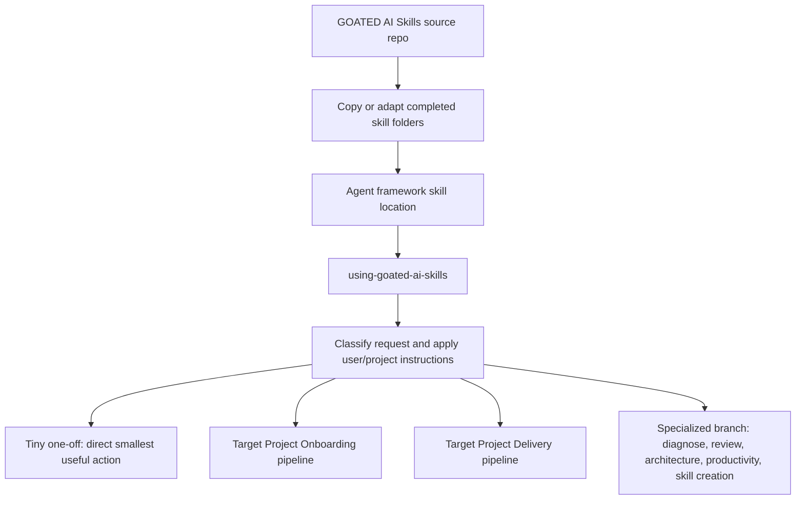
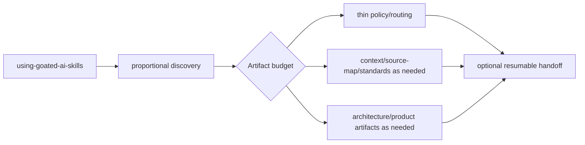
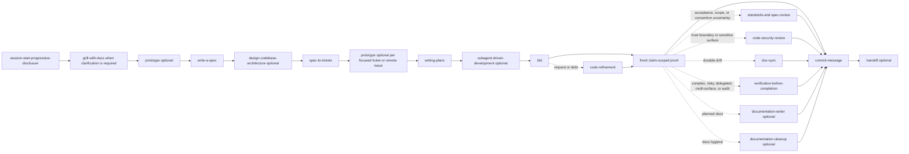
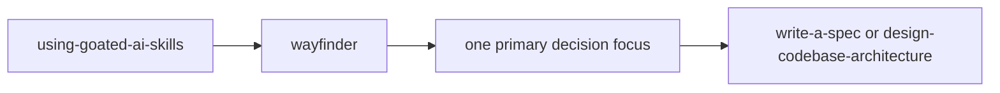

# How To Use GOATED AI Skills

This is the user guide for running GOATED AI Skills after installation. V2
supports a recommended integrated mode and a preserved individual skill mode.

For installation mechanics, start with [install.md](install.md). This guide picks up after that: how to route work, how the two main pipelines fit together, and what each skill contributes.

## Mental Model

GOATED AI Skills has three distinct contexts:

- **Source repo**: the GOATED AI Skills public repository, where reusable skill folders are published and maintained.
- **Installed skills**: copied skill folders inside an agent framework such as Codex, Claude Code, Hermes, OpenCode, or another tool-calling environment.
- **Target project**: the user's actual project where installed skills help with onboarding, planning, implementation, review, documentation, and handoff.

Do not treat the GOATED AI Skills repository as a project template. In
integrated mode, install selected skill folders with the shared policy,
registry, schema, and templates under `stack/`. In individual mode, copy one
complete skill folder and use its standalone guidance.

Current V2 notes:

- Implemented skills use standards-first Agent Skills frontmatter with GOATED category metadata.
- Individually installed skills retain compact standalone behavior.
- Integrated installs share universal behavior through `stack/AGENTS.md`.
- Runtime bootstrap, automatic activation, generated plugin manifests, hook
  setup, installer scripts, and framework detection automation remain out of
  scope.
- Tiny one-off tasks can skip the full workflow when the request is small, obvious, and low risk.
- Existing V1 installations can follow
  [the migration guide](migration-v1-to-v2.md); release evidence is recorded in
  [the acceptance report](v2-acceptance-report.md).

## The Full Stack

The stack has three layers:

1. **Skill Pack Distribution**: clone, download, copy, install, or adapt the skill folders into your chosen agent framework.
2. **Target Project Onboarding**: prepare a target project for durable, repeated, cross-file, spec-level, architectural, or public-facing work, including optional spec capture when onboarding uncovers project-level product scope.
3. **Target Project Delivery**: move one target-project change from intent through planning, implementation, review, documentation, verification, and handoff.

Use `using-goated-ai-skills` as the router when you or your agent are unsure which path applies.


```mermaid
flowchart TB
  Source["GOATED AI Skills source repo"] --> Install["Copy or adapt completed skill folders"]
  Install --> Framework["Agent framework skill location"]
  Framework --> Router["using-goated-ai-skills"]
  Router --> Classify["Classify request and apply user/project instructions"]
  Classify --> Tiny["Tiny one-off: direct smallest useful action"]
  Classify --> Onboarding["Target Project Onboarding pipeline"]
  Classify --> Delivery["Target Project Delivery pipeline"]
  Classify --> Specialized["Specialized branch: diagnose, review, architecture, productivity, skill creation"]
```

## Pipeline 1: Target Project Onboarding

Onboarding selects a lightweight, standard, or full artifact budget from one
shared discovery evidence bundle. It creates or incrementally refreshes only
the artifacts that solve demonstrated retrieval, terminology, standards,
architecture, routing, or continuity needs.


```mermaid
flowchart LR
  A["using-goated-ai-skills"] --> B["proportional discovery"]
  B --> C{"Artifact budget"}
  C --> D["thin policy/routing"]
  C --> E["context/source-map/standards as needed"]
  C --> F["architecture/product artifacts as needed"]
  D --> G["optional resumable handoff"]
  E --> G
  F --> G
```

Typical flow:

1. Let `using-goated-ai-skills` classify onboarding intensity and reuse fresh
   session state silently.
2. Run one focused discovery pass and select an artifact budget.
3. Use `agent-instructions-integrator` for thin policy and routing. Lightweight
   projects can stop here.
4. Add `context-matrix-map`, `project-context-calibration`, or
   `project-standards-calibration` only for demonstrated gaps; refresh existing
   artifacts instead of rebuilding them.
5. Add architecture or product artifacts only when discovery justifies them.
6. For resumable work, write the envelope and handoff under verified-ignored
   `.local/goated/`; use OS temp when project-local state is inappropriate.

Possible durable target-project artifacts include:

- `CONTEXT.md`
- `docs/agents/context-matrix.md`
- `docs/agents/project-standards.md`
- `docs/agents/external-docs/` optional dated, attributed lookup notes when external docs materially inform work
- `docs/specs/` only when onboarding needs durable product scope, roadmap intent, or acceptance criteria
- `docs/agents/architecture-plan.md` when a project-wide architecture blueprint is useful
- `docs/wayfinding/<effort-slug>/` when approved branching uncertainty needs a
  durable local map and no configured tracker is used
- ignored `.local/goated/` envelopes and handoffs for resumable work after
  ignore verification
- OS temp handoffs under `goated-handoffs/<project-name>/` as the fallback

## Pipeline 2: Target Project Delivery

Run delivery when you want to make a real change in a target project. For serious work, delivery assumes onboarding has already happened or starts by gathering the missing context.


```mermaid
flowchart LR
  A["session-start-progressive-disclosure"] --> B["grill-with-docs when clarification is required"]
  B --> C["prototype optional"]
  C --> D["write-a-spec"]
  D --> E["design-codebase-architecture optional"]
  E --> F["spec-to-tickets"]
  F --> G["prototype optional per focused ticket or remote issue"]
  G --> H["writing-plans"]
  H --> I["subagent-driven-development optional"]
  I --> J["tdd"]
  J -. "request or debt" .-> K["code-refinement"]
  J --> V["fresh claim-scoped proof"]
  K --> V
  V -. "acceptance, scope, or convention uncertainty" .-> L["standards-and-spec-review"]
  V -. "trust boundary or sensitive surface" .-> M["code-security-review"]
  V -. "durable drift" .-> P["doc-sync"]
  V -. "complex, risky, delegated, multi-surface, or audit" .-> Q["verification-before-completion"]
  V -. "planned docs" .-> N["documentation-writer optional"]
  V -. "docs hygiene" .-> O["documentation-cleanup optional"]
  V --> R["commit-message"]
  L --> R
  M --> R
  P --> R
  Q --> R
  N --> R
  O --> R
  R --> S["handoff optional"]
```

Typical flow:

1. Use `session-start-progressive-disclosure` to gather just enough context.
2. Use `grill-with-docs` when the work is unclear, architectural, public-facing, cross-file, standards-sensitive, or spec-level.
3. Use `prototype` before committing to a risky product, UI, logic, or technical choice.
4. Use `write-a-spec` for fuzzy ideas, then `spec-to-tickets` to break the approved spec into fresh-agent-ready local delivery tickets and an order file for multi-ticket sets.
5. Use `design-codebase-architecture` when the module shape, interfaces, dependencies, or implementation slices need source-grounded architecture design before code.
6. Use `writing-plans` immediately before implementation to produce exact steps, evidence, stop conditions, and review gates.
7. Use `subagent-driven-development` for larger or riskier work when bounded implementer and reviewer agents are available.
8. Use `tdd` for behavior changes, bug fixes, public interfaces, and regression coverage.
9. Use `code-refinement` after implementation proof only when cleanup was explicitly requested or concrete refinement debt is observed.
10. Use `documentation-writer` when planned durable docs are part of the work. Use `documentation-cleanup` when the docs tree, root routing docs, progress/status docs, or agent-facing docs need broader hygiene.
11. Use `doc-sync` when changed behavior or docs may have made other docs stale.
12. Match every completion claim to fresh evidence. Load
    `standards-and-spec-review` for acceptance, scope, or convention
    uncertainty; `code-security-review` for changed trust boundaries or
    sensitive surfaces; `doc-sync` for plausible durable drift; and
    `verification-before-completion` for complex, high-risk, delegated,
    multi-surface, or explicitly audited closeout. Narrow work verifies
    directly without ceremonial skip reports.
13. Use `commit-message` and optional `handoff` for closeout.

## Pipeline 3: Multi-Session Uncertainty

Use Wayfinder only when uncertainty branches across more than one focused
session and later decisions depend on earlier evidence. Do not use it for one
focused discussion or for large implementation whose product and architecture
decisions are already settled.


```mermaid
flowchart LR
  A["using-goated-ai-skills"] --> B["wayfinder"]
  B --> C["one primary decision focus"]
  C --> D["write-a-spec or design-codebase-architecture"]
```

Before writing a map, approve its destination, location, visible frontier,
action reach, and initial write scope. With no configured tracker, the portable
fallback is `docs/wayfinding/<effort-slug>/`. The map can coordinate grilling,
research, disposable prototypes, and bounded prerequisites, each independently
classified as `AFK` or `HITL`. Production implementation, migration execution,
publication, and deployment are prohibited.

## Skill Reference

Each skill is listed with its current role. Read the installed skill's own
`SKILL.md` when you need the full workflow, guardrails, dependencies, or output
contract.

### Agent Workflows

#### `using-goated-ai-skills`

- **Purpose**: Routes an installed GOATED skill stack to the right workflow while respecting user and project instructions.
- **Use when**: You are unsure whether a request is onboarding, delivery, installation/adaptation, source-repo maintenance, prompt-crafting, tiny direct work, or an explicit override.
- **Typical input**: User request, current project boundary, applicable project instructions, and known installed skill list.
- **Typical output**: Task-surface classification, instruction-precedence decision, selected skill path, and assumptions.
- **Pipeline role**: First router for the whole stack.

#### `session-start-progressive-disclosure`

- **Purpose**: Starts work by loading the smallest useful context instead of flooding the agent with every file.
- **Use when**: A new session starts, the project is unfamiliar, or the agent needs to choose what context to inspect before planning or implementation.
- **Typical input**: User request, current directory, repo instructions, available context docs, and likely task surface.
- **Typical output**: Concise orientation, task classification, first-read sources, and next workflow route.
- **Pipeline role**: First step in both onboarding and delivery.

#### `context-matrix-map`

- **Purpose**: Creates a durable source map for future agents.
- **Use when**: Onboarding a project for serious work or deciding what future agents should read first, second, or only if needed.
- **Typical input**: Project docs, repo layout, manifests, tests, important source areas, and existing agent artifacts.
- **Typical output**: `docs/agents/context-matrix.md` with source tiers, code areas, commands, decisions, optional external-doc lookup notes, gaps, and assumptions.
- **Pipeline role**: Early onboarding artifact that keeps future sessions efficient.

#### `project-context-calibration`

- **Purpose**: Creates or refreshes durable project language and boundaries.
- **Use when**: A target project needs clear definitions for project boundaries, domain terms, artifacts, architecture vocabulary, or non-boundaries.
- **Typical input**: Existing docs, README files, architecture notes, issue language, and observed source terms.
- **Typical output**: Root `CONTEXT.md` by default, with public project language and durable definitions.
- **Pipeline role**: Onboarding step that gives future agents shared vocabulary.

#### `project-standards-calibration`

- **Purpose**: Captures documented standards, inferred conventions, user-confirmed preferences, and unresolved standards questions separately.
- **Use when**: Onboarding a project or clarifying conventions, commands, enforcement levels, preferences, and unresolved standards questions.
- **Typical input**: Docs, config, scripts, tests, observed conventions, and user-confirmed preferences.
- **Typical output**: `docs/agents/project-standards.md` by default.
- **Onboarding note**: If project evidence does not already decide code style, the skill can capture a user-confirmed code-style posture as `preference-only`; documented standards and tooling still win.
- **Pipeline role**: Onboarding step that prevents standards from being rediscovered or guessed.

#### `agent-instructions-integrator`

- **Purpose**: Connects installed skills and durable target-project artifacts to the project's agent instruction layer.
- **Use when**: A target project needs a thin adapter for Codex, Claude Code, Hermes, OpenCode, or a generic agent workflow.
- **Typical input**: Existing agent instructions, installed skill locations, target-project artifacts, and framework constraints.
- **Typical output**: Selected instruction artifact or configuration and concise routing notes.
- **Pipeline role**: Onboarding step that makes the installed stack discoverable without copying every skill body into project instructions.

#### `handoff`

- **Purpose**: Writes compact continuity notes for future sessions or agents.
- **Use when**: Work is unfinished, context may be lost, a future agent needs the next step, or a restart note would reduce risk.
- **Typical input**: Current status, evidence, changed files, unresolved questions, skipped checks, and next action.
- **Typical output**: Ignored project-local handoff under
  `.local/goated/handoffs/` for resumable work after ignore verification, with
  OS temp as the fallback.
- **Pipeline role**: Optional closeout for onboarding or delivery.

#### `framework-agnostic-skill-creator`

- **Purpose**: Creates or ports skills into GOATED's portable skill shape.
- **Use when**: Creating a new GOATED skill from clarified intent or adapting an existing workflow, command, prompt, or instruction for public-safe reuse.
- **Typical input**: Source material, target audience, trigger patterns, output contract, dependencies, compatibility constraints, and portability constraints.
- **Typical output**: Clarified skill intent, evaluation notes, and a GOATED-shaped skill package plan or artifact.
- **Pipeline role**: Specialized branch for extending or adapting the skill library, not normal target-project delivery.

#### `wayfinder`

- **Purpose**: Navigates only the visible decision frontier for branching,
  multi-session uncertainty.
- **Use when**: Later decisions depend on earlier answers and the complete route
  to a named planning destination cannot yet be specified responsibly.
- **Reject when**: The discussion fits one focused session, or a large
  implementation is already specified.
- **Typical input**: Proposed destination and completion condition, evidence,
  constraints, approval scope, action reach, and an existing map when present.
- **Typical output**: An approved map, separate decision records, fog/frontier
  deltas, lifecycle state, and an evidence-reusing handoff to a named planning
  destination.
- **Pipeline role**: Optional uncertainty-navigation branch before
  `write-a-spec`, `design-codebase-architecture`, or another named planning
  destination; never a production-execution route.

### Engineering

#### `grill-with-docs`

- **Purpose**: Pressure-tests important work against available docs and project facts before implementation.
- **Use when**: Work is unclear, spec-level, architectural, cross-file, public-facing, standards-sensitive, or requires scope and success criteria alignment.
- **Typical input**: User request, project docs, standards, context docs, ADRs, source facts, and known constraints.
- **Typical output**: Clarified goal, success criteria, scope, non-goals, decisions, assumptions, and candidate durable updates.
- **Pipeline role**: Mandatory gate for onboarding and many serious delivery requests.

#### `write-a-spec`

- **Purpose**: Turns fuzzy intent into a proportionate compact or full target-project spec.
- **Use when**: A feature idea, roadmap item, client brief, or delivery change needs durable scope before ticket slicing.
- **Typical input**: Clarified intent, audience, goals, non-goals, requirements, constraints, and source evidence.
- **Typical output**: Tracked target-project spec under `docs/specs/` by default.
- **Pipeline role**: Proportional planning before ticket slicing, or an optional onboarding decision point when project-level intent needs durable capture.

#### `spec-to-tickets`

- **Purpose**: Breaks an approved spec into dependency-ordered local delivery tickets, using vertical slices by default and expand-migrate-contract only for qualifying wide mechanical refactors.
- **Use when**: A product or delivery spec is ready to become portable implementation slices.
- **Typical input**: Approved spec, user stories, acceptance criteria, blockers, dependencies, and source references.
- **Typical output**: Fresh-agent-ready Markdown tickets under `tickets/` by default, plus a refreshed local order file and ready frontier for multi-ticket sets.
- **Pipeline role**: Converts product intent into implementation-ready slices.

#### `writing-plans`

- **Purpose**: Turns an approved ticket, scoped task, or spec slice into a just-in-time implementation plan.
- **Use when**: Work is scoped enough to implement, but the agent needs exact steps, evidence, commands, stop conditions, and review gates.
- **Typical input**: Ticket, spec slice, current source evidence, relevant docs, likely tests, and user constraints.
- **Typical output**: Inline plan in the work envelope for focused single-session work, or a durable tracked plan for resumable, delegated, architectural, or multi-surface work. Inline plans can be promoted without repeating fresh discovery.
- **Pipeline role**: Final planning step before implementation.

#### `subagent-driven-development`

- **Purpose**: Coordinates bounded implementer and reviewer agents while the main agent keeps ownership.
- **Use when**: Implementation is larger, riskier, review-heavy, or parallelizable with clear write scopes.
- **Typical input**: Approved implementation plan, owned file scopes, source context, expected evidence, and fallback path.
- **Typical output**: Task split, implementer dispatch prompts, reviewer prompts, integration evidence, and residual risk.
- **Pipeline role**: Optional delivery accelerator for bigger work.

#### `prototype`

- **Purpose**: Creates disposable evidence before committing to a product or technical direction.
- **Use when**: One focused question needs a quick spike, mockup, variant, throwaway implementation, or cheap proof.
- **Typical input**: Prototype question, constraints, branch or artifact preference, success criteria, and what can be discarded.
- **Typical output**: Prototype artifact, verdict, assumptions, and recommended next path.
- **Pipeline role**: Optional before specs or legacy PRDs, architecture choices, or focused implementation tickets.

#### `diagnose`

- **Purpose**: Investigates failures before proposing or implementing fixes.
- **Use when**: There is a bug, flaky test, build failure, integration failure, performance regression, or unexpected behavior.
- **Typical input**: Symptom, environment, repro steps, logs, tests, source area, and safety constraints.
- **Typical output**: Repro evidence, hypotheses, root-cause proof, ruled-out causes, and fix direction.
- **Pipeline role**: Specialized delivery branch before `writing-plans` or `tdd`.

#### `tdd`

- **Purpose**: Guides behavior-first red, green, refactor work.
- **Use when**: Implementing behavior, fixing bugs, changing public interfaces, or adding regression coverage.
- **Typical input**: Observable behavior, public test surface, acceptance criteria, source area, and test command.
- **Typical output**: Failing test evidence, implementation evidence, refactor notes, and rerun proof.
- **Pipeline role**: Main implementation discipline for behavior-changing delivery work.

#### `code-refinement`

- **Purpose**: Refines recently changed code after implementation while preserving behavior.
- **Use when**: Cleanup was explicitly requested, or a scoped diff contains concrete debt such as confusing names, duplication, excessive branching, shallow indirection, unnecessary abstraction, or difficult local reasoning. Generated or agent-written origin activates the skill only when focused review finds such debt.
- **Typical input**: Current diff, task-touched files, explicit paths, relevant proof commands, local style evidence, and dirty-worktree constraints.
- **Typical output**: Refinements made or proposed, behavior-preservation proof, public-interface impact, docs/security follow-up, deferred candidates, and residual risk.
- **Pipeline role**: Conditional behavior-preserving cleanup after `tdd` or implementation proof and before relevant review gates.

#### `receiving-code-review`

- **Purpose**: Handles reviewer feedback without blindly accepting or rejecting comments.
- **Use when**: Review feedback must be classified as accepted, rejected, unclear, or requiring a user decision.
- **Typical input**: Review comments, diff, source context, tests, standards, and user intent.
- **Typical output**: Compact classifications, evidence, accepted work, technical pushback, user decisions, and route deltas.
- **Pipeline role**: Specialized branch before review gates or follow-up implementation.

#### `resolving-merge-conflicts`

- **Purpose**: Resolves conflicts in active Git merges, rebases, cherry-picks, and reverts by preserving the intent behind both sides.
- **Use when**: Git reports unmerged paths and the correct resolution depends on commits, pull requests, issues, tests, docs, or another primary source of intent.
- **Typical input**: Current Git operation and branch state, unmerged paths and index stages, intent evidence for both sides, project checks, action reach, and lifecycle authorization.
- **Typical output**: Detected operation and exact conflict scope, two-sided intent evidence, compatible resolutions or explicit semantic decisions, scoped check results, and one authorized or recommended next state.
- **Pipeline role**: Independent engineering branch for an operation already in progress. Loading it never grants permission to stage, commit, continue, skip, abort, push, or mutate a protected branch; standalone use applies the same boundary without requiring the integrated registry.

#### `source-grounded-research`

- **Purpose**: Investigates one current external question against a question-specific source hierarchy and returns cited, freshness-aware findings.
- **Use when**: A current public or authorized external question needs primary-source preference, claim-scoped dates and provenance, or explicit handling of stale, conflicting, or missing evidence.
- **Typical input**: Exact question, decision use, applicable scope, currency requirement, user-provided or known sources, source-access constraints, data sensitivity, and inline or optional durable output mode.
- **Typical output**: Best-supported answer with claim-near citations, distinct findings and inference, disagreements or gaps, a compact evidence delta, and capability limits.
- **Pipeline role**: External research specialist. Inline read-only output is complete; durable Markdown is optional and must reuse a project-owned research convention or the existing external-doc lookup-note convention. It does not replace local `knowledge-retrieval` or automatically invoke `learning-capture`.

#### `standards-and-spec-review`

- **Purpose**: Reviews changes against project standards and the originating spec, ticket, or remote issue.
- **Use when**: Diff size, risk, acceptance ambiguity, scope fit, or uncertain conventions make direct review insufficient.
- **Typical input**: Fixed point, changed files, originating spec or legacy PRD, ticket or remote issue, standards docs, and evidence commands.
- **Typical output**: Findings for the activated standards and/or spec axis, with source evidence and route deltas.
- **Pipeline role**: Conditional review gate after implementation.

#### `code-security-review`

- **Purpose**: Performs focused static security review of risky changes.
- **Use when**: A trust boundary changes or work touches auth, permissions, secrets, private data, persistence policy, unsafe execution, dependency security, or another sensitive surface.
- **Typical input**: Diff or source area, trust boundary, sensitive assets, entry points, sinks, and security-relevant docs.
- **Typical output**: Security findings or a scoped no-finding result, trust path, residual risk, and route deltas.
- **Pipeline role**: Security gate for relevant delivery work.

#### `documentation-writer`

- **Purpose**: Creates or substantially revises durable documentation from source evidence and audience needs.
- **Use when**: You need a manual, operator guide, runbook, troubleshooting guide, onboarding guide, product doc, or separate AI-facing guide.
- **Typical input**: Documentation goal, audience, target-project docs conventions, source evidence, assumptions, and verification expectations.
- **Typical output**: The requested document first, plus only material paths,
  evidence, verification, gaps, and doc-sync signals.
- **Pipeline role**: Planned documentation authoring step before `doc-sync` checks whether related docs drifted.

#### `documentation-cleanup`

- **Purpose**: Audits, tidies, consolidates, and optimizes documentation trees and agent-facing docs.
- **Use when**: A project has bulky, duplicated, stale, unclear, or hard-to-navigate docs across `docs/`, `docs/agents/`, root routing docs, progress/status docs, or issue workbenches.
- **Typical input**: Target-project root, docs folders, root README/context files, agent instruction adapters, progress/status docs, and local source-of-truth conventions.
- **Typical output**: The cleanup audit, plan, or applied result, with only
  material findings, approval needs, evidence, changes, and residual risk.
- **Pipeline role**: Periodic documentation hygiene step. It stays separate from planned authoring (`documentation-writer`) and changed-behavior drift checks (`doc-sync`).

#### `doc-sync`

- **Purpose**: Keeps durable docs aligned with changed behavior, interfaces, architecture, standards, configuration, tests, or workflows.
- **Use when**: Implementation, review, architecture, standards, or public docs work may have created documentation drift.
- **Typical input**: Changed facts, diffs, spec or legacy PRD evidence, ticket or remote-issue evidence, tests, commands, external-doc lookup evidence, and relevant docs.
- **Typical output**: A compact documentation-impact delta. No-impact results
  omit empty update sections; required updates retain artifact-level detail.
- **Pipeline role**: Closeout gate after implementation or documentation-affecting work.

#### `verification-before-completion`

- **Purpose**: Gates completion, correctness, readiness, and success claims on fresh evidence.
- **Use when**: A completion claim is complex, high-risk, delegated, multi-surface, or explicitly audited. Narrow work uses direct fresh proof.
- **Typical input**: The exact claim, changed scope, command output, diff, artifacts, skipped checks, and known failures.
- **Typical output**: A verification delta covering fresh/reused/invalidated evidence, proof gaps, residual risk, and the allowed claim.
- **Pipeline role**: Conditional full controller; evidence-backed claim scope remains universal.

#### `commit-message`

- **Purpose**: Drafts concise commit text from local diffs and evidence.
- **Use when**: You want to draft or revise a Git commit message for selected local changes.
- **Typical input**: Git diff/status, changed files, user-selected scope, evidence, and docs/test results.
- **Typical output**: Commit message text first. Commands appear only when the
  user explicitly asks for them.
- **Pipeline role**: Delivery closeout after verification and doc sync.

#### `architecture-design-map`

- **Purpose**: Produces descriptive, source-grounded architecture or design maps.
- **Use when**: You need a module map, dependency map, flow map, runtime topology, or quick zoom-out orientation.
- **Typical input**: Focused source area, imports/callers, architecture docs, routes, schemas, tests, and context artifacts.
- **Typical output**: the smallest useful representation, explanation, source references, and uncertainty notes.
- **Pipeline role**: Optional current-state onboarding or delivery orientation step, not a spec prerequisite or planning substitute.

#### `design-codebase-architecture`

- **Purpose**: Prescribes source-grounded architecture before implementation.
- **Use when**: A clarified brief, spec or legacy PRD, ticket or remote issue, or grill result needs module boundaries, interfaces, dependency seams, test surfaces, or slice order.
- **Typical input**: Clarified intent, source evidence, existing architecture docs, constraints, risks, and acceptance criteria.
- **Typical output**: Project-wide, feature-specific, or inline architecture blueprint using the smallest useful representation.
- **Pipeline role**: Optional architecture planning step in onboarding or delivery.

#### `review-codebase-architecture`

- **Purpose**: Reviews source-grounded architecture improvement opportunities without prescribing or implementing the replacement design.
- **Use when**: You want to identify shallow modules, tight coupling, hard-to-test areas, unclear interfaces, or refactor direction.
- **Typical input**: Review scope, source evidence, tests, docs, architecture vocabulary, and observed pain points.
- **Typical output**: Ranked improvement opportunities with evidence and risk notes.
- **Pipeline role**: Review-only branch that emits one justified next-step signal, often `design-codebase-architecture`, `code-refinement`, or `tdd`.

### Productivity

#### `goated-prompt`

- **Purpose**: Turns rough requests into GOATED-aware prompts or portable reusable prompts.
- **Use when**: You want to improve, rewrite, optimize, or classify a prompt; make a request work with the GOATED workflow; or create a reusable prompt for a coding assistant or reasoning model.
- **Typical input**: Raw request, rough prompt, existing output, intended recipient, constraints, success criteria, and any context the prompt should preserve.
- **Typical output**: The optimized prompt first. Route notes, assumptions, and
  structural explanation follow only when material or requested.
- **Pipeline role**: Productivity aid for prompt quality and GOATED-aware request translation. It routes to `grill-with-docs`, `write-a-spec`, `writing-plans`, or `framework-agnostic-skill-creator` when those skills should own the next step.

#### `knowledge-retrieval`

- **Purpose**: Retrieves durable project knowledge progressively and read-only, ranks results for the exact claim, and adds provenance-aware references to shared evidence.
- **Use when**: A question should be answered from project notes, decisions, standards, source, tests, or other durable local artifacts and authority, freshness, conflict, or uncertainty matters.
- **Typical input**: The question and scope, explicit paths, existing evidence entries, project source maps, ordinary files, and optional in-scope search capabilities.
- **Typical output**: A best-supported answer, ranked and classified evidence, explicit stale or conflicting sources, a shared-evidence delta, and capability or uncertainty limits.
- **Pipeline role**: Read-only knowledge consumer. It may recommend a separate `learning-capture` nurture run but never edits notes, builds indexes, or performs external web research.

#### `learning-capture`

- **Purpose**: Captures durable, reusable lessons as atomic Markdown notes for human reading and future agent reuse.
- **Use when**: You want to capture what was learned from a session, extract lessons from provided material, document reusable discoveries, or nurture existing knowledge notes.
- **Typical input**: Current-session context, user-provided notes or excerpts, destination hints, existing related notes, evidence, and privacy constraints.
- **Typical output**: Candidate lesson cards, portable Markdown notes when the
  active approval mode covers writes, and only non-empty audit categories.
- **Pipeline role**: Optional learning closeout and knowledge-note workflow. It writes and nurtures notes, but does not replace broad knowledge-base retrieval, synthesis, or Q&A.

#### `setup-scribe`

- **Purpose**: Maintains one ordered, current, evidence-labelled recipe for recreating a project's working environment.
- **Use when**: Project-dependent installation, environment or settings changes, manual setup, undocumented setup backfill, recipe drift, or replay automation would otherwise be lost or stale.
- **Typical input**: Current project sources, setup observations, supported environments, user recollection, existing setup docs, action reach, consent, and available verification.
- **Typical output**: A project-first setup recipe, classified drift audit, or safe Bash-first automation proposal with `verified`, `source-backed`, and `unverified` steps.
- **Pipeline role**: Conditional reproducibility gate selected on `reproducibility-impact`. It points to declarative sources, excludes unrelated personal settings, and never treats generated automation as executed or verified. Targeted changed-fact checks remain with `doc-sync`, substantial guides with `documentation-writer`, reusable lessons with `learning-capture`, and continuity notes with `handoff`.

#### `caveman`

- **Purpose**: Keeps replies compact when the user explicitly asks for brief, terse, or caveman-style communication.
- **Use when**: The user wants fewer tokens or compact answers without losing required technical substance.
- **Typical input**: User preference for compact mode, current task, and required response constraints.
- **Typical output**: Terse but complete response without reducing
  implementation, evidence, safety, or required artifact detail.
- **Pipeline role**: Communication-mode override, not a delivery pipeline stage.

#### `grill-me`

- **Purpose**: Interviews the user about an idea, decision, lightweight plan, or non-docs-grounded topic.
- **Use when**: You want a challenge or interview but project docs are not required.
- **Typical input**: Idea, decision, options, context, constraints, and desired outcome.
- **Typical output**: Clarified topic, assumptions, tradeoffs, options, tensions, and next step.
- **Pipeline role**: Lightweight thinking aid outside the docs-grounded delivery pipeline.

## Prompt Starters

Use prompts like these after the skill folders are installed.

### Onboard a project

```text
Use GOATED AI Skills to onboard this project proportionally. Reuse one
discovery evidence bundle, select a lightweight, standard, or full artifact
budget, and create or incrementally refresh only the routing, context, source,
standards, architecture, or continuity artifacts that solve a demonstrated
need.
```

### Start a delivery change

```text
Use GOATED AI Skills for this feature idea. Clarify the intent against project docs, decide whether we need a spec or prototype, then route through the delivery pipeline until there is an implementation-ready plan.
```

### Craft or refine a prompt

```text
Use GOATED AI Skills to turn this rough request into a better prompt. Start with using-goated-ai-skills if the route is unclear, then use goated-prompt to choose the prompt type, calibrate context, name assumptions, and route to companion skills only when they should own the next step.
```

### Retrieve durable project knowledge

```text
Use knowledge-retrieval to answer this question from scoped project files and
notes. Search progressively and read-only, rank sources for the exact claim,
report stale or conflicting knowledge, and add provenance-aware shared
evidence without nurturing or rewriting any note.
```

### Research current external evidence

```text
Use source-grounded-research to answer this current external question. Frame
the exact decision and currency requirement, choose a question-specific source
hierarchy, prefer primary sources, cite material claims, distinguish findings
from inference and disagreement, and answer inline unless durable capture is
explicitly requested and authorized.
```

### Preserve or reconstruct project setup

```text
Use setup-scribe to capture, backfill, audit, or automate this project's setup.
Keep one ordered current recipe, reference existing manifests and configuration,
label every material step as verified, source-backed, or unverified, prefer
portable Bash, and do not execute generated automation without separate
approval.
```

### Implement a scoped ticket or remote issue

```text
Use GOATED AI Skills on this approved ticket or remote issue. Write a just-in-time implementation plan, use TDD for behavior changes, run the relevant review and doc-sync gates, and verify before claiming the work is complete.
```

### Review and close out work

```text
Use GOATED AI Skills to review this change against the spec and project standards, run a security review if relevant, sync any docs that drifted, verify the final claim, and draft a commit message.
```

### Preserve continuity

```text
Use GOATED AI Skills to write a handoff for the next agent. Include the current status, evidence, changed files, skipped checks, unresolved questions, and exact next step.
```

## Practical Routing Rules

- If the request is tiny, obvious, and low risk, use the smallest useful context and act directly.
- If the request is to improve, rewrite, optimize, or create a reusable prompt, use `goated-prompt`; let it route onward only when another skill should own the next step.
- If the request is unfamiliar or cross-file, start with `session-start-progressive-disclosure`.
- If the request needs product or scope clarity, use `grill-with-docs`.
- If a current external question needs cited public or authorized sources,
  freshness checks, or conflict handling, use `source-grounded-research`.
- If a question should be answered from durable project artifacts and source
  authority or freshness matters, use `knowledge-retrieval`; use
  `learning-capture` separately for approved note writes or nurturing.
- If project-dependent setup knowledge is missing, changed, stale, or ready for
  replay automation, use `setup-scribe`; skip it when no reproducibility impact
  exists.
- If the request is fuzzy and user-facing, use `write-a-spec` before implementation planning.
- If onboarding uncovers project-level product scope, roadmap intent, or acceptance criteria, use `write-a-spec` before architecture planning; otherwise skip spec creation.
- If architecture shape must be prescribed, use `design-codebase-architecture`; for review-only findings use `review-codebase-architecture`; if you only need a descriptive map, use `architecture-design-map`.
- If behavior changes, route implementation through `tdd`.
- Use `code-refinement` after implementation proof when cleanup is explicitly requested or concrete refinement debt is observed. Ordinary refactor-after-green remains inside `tdd`.
- If planned durable documentation is the work, or part of the work, use `documentation-writer`; if docs structure or agent docs are messy, use `documentation-cleanup`; use `doc-sync` for drift checks after behavior or docs change.
- Match "done", "correct", "passing", "synced", and "ready" claims to fresh
  evidence. Use `verification-before-completion` for complex, high-risk,
  delegated, multi-surface, or explicitly audited closeout; verify narrow work
  directly.

## Source References

These references are for humans maintaining, installing, or adapting the library. Installed agents should rely on their local installed `SKILL.md` files and start with installed `using-goated-ai-skills`; they should not require this source repo's root docs at runtime.

- [README.md](../README.md) - public distribution model, three-layer use model, and pipeline summaries.
- [CONTEXT.md](../CONTEXT.md) - domain language for source repo, installed skills, target projects, artifacts, and operating principles.
- [install.md](install.md) - docs-first installation and adaptation guidance.
- [ADR 0001](adr/0001-v1-runtime-bootstrap-and-adapter-automation.md) - historical V1 decision against runtime bootstrap and adapter automation.
- [ADR 0002](adr/0002-v2-integrated-stack-foundation.md) - V2 integrated-stack installation and standalone fallback boundary.
- [skills/README.md](../skills/README.md) - skill schema, categories, progressive disclosure, and delegation conventions.
- [Agent Workflows README](../skills/agent-workflows/README.md) - implemented agent-workflow skills.
- [Engineering README](../skills/engineering/README.md) - implemented engineering skills and closeout gate guidance.
- [Productivity README](../skills/productivity/README.md) - implemented productivity skills.
