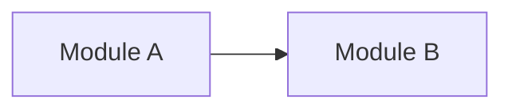

# Architecture Design Map

## Purpose

Create descriptive, source-grounded architecture and design maps for target projects. Use Mermaid by default for detailed maps, attach source evidence to every meaningful diagram claim, and mark uncertainty instead of inventing missing structure.

This skill has two common modes. The primary mode is a detailed architecture/design map for a project, subsystem, flow, runtime topology, or durable target-project artifact. The lightweight mode is quick inline zoom-out for orienting around unfamiliar code by going up one layer to surrounding modules, callers, importers, and project vocabulary.

This skill maps architecture that exists in code or is explicitly documented. It does not plan new architecture, improve architecture, rank refactor opportunities, design interfaces, or produce before/after refactor proposals.

## Inputs

- User request, target-project root, map scope, and preferred output location when provided.
- Existing `docs/agents/context-matrix.md`, root `CONTEXT.md`, `docs/agents/project-standards.md`, and `docs/agents/architecture-map.md`, if present.
- Architecture docs, ADRs, PRDs, specs, README files, runbooks, deployment docs, API docs, schema docs, and agent instructions.
- Source files, manifests, route definitions, package/module indexes, service entrypoints, data-access code, tests, fixtures, config, CI, deployment, infrastructure, and integration definitions.
- User-provided screenshots, sketches, or external docs only when they are explicitly part of the target-project evidence.

## Architecture Language

- **Module**: anything with an interface and an implementation, such as a function, class, package, feature slice, subsystem, route group, or tier-spanning flow.
- **Interface**: what callers or tests must know to use a module correctly, including types, methods, invariants, ordering, error modes, configuration, and relevant performance expectations.
- **Implementation**: the code and internal structure behind a module's interface.
- **Seam**: the place where a module's interface lives and where behavior can vary without editing the caller.
- **Adapter**: a concrete implementation that satisfies an interface at a seam, usually for production, testing, or external integration.

Use project domain terms from target-project evidence when naming map nodes. Use generic architecture terms only when the project does not define a better local term.

## Workflow

1. Confirm the target-project boundary and map mode:
   - Identify the project root from the user's request, current directory, repository metadata, or local manifests.
   - Classify the request as a detailed existing-code map, docs-backed map, partial/mixed map, runtime or flow map, or quick inline zoom-out.
   - Keep detailed maps as the default for broad architecture/design requests, durable artifacts, system diagrams, and flow/topology questions.
   - Use quick inline zoom-out only when the user is unfamiliar with a focused code area and wants to go up one layer to see relevant modules, callers, importers, and project vocabulary.
   - Keep installed-skill instructions separate from target-project artifacts.
   - Ask only when the target root, requested map scope, or output destination cannot be inferred safely.

2. Choose durable artifact versus inline response:
   - Write `docs/agents/architecture-map.md` by default for target-project onboarding, repeated work, broad architecture documentation, or user-requested persistence.
   - Answer inline for quick one-off map requests, narrow explanations, or exploratory questions where a durable artifact would add ceremony; inline responses may still be detailed when the requested scope needs it.
   - For quick inline zoom-out, do not create or update a durable architecture-map artifact unless the user explicitly asks for persistence.
   - When refreshing an existing architecture map, read it first and preserve accurate sourced facts.

3. Gather source evidence before diagramming:
   - Use `docs/agents/context-matrix.md` when present to choose first-read and second-read sources.
   - Read architecture docs, ADRs, context files, standards profiles, README files, manifests, entrypoints, routes, schemas, config, deployment definitions, and representative tests as relevant to the requested map.
   - For quick inline zoom-out, inspect the focused file, symbol, feature, route, module, or subsystem plus its imports, exports, nearby callers or importers, entrypoints, representative tests, and available glossary or context terms.
   - For code maps, trace actual imports, calls, routes, data flow, configuration, or runtime links rather than relying on folder names alone.
   - For docs-backed maps, diagram only relationships explicitly described by durable docs or user-provided evidence.
   - When caller or importer evidence is missing in a quick zoom-out pass, say it was not found or not inspected instead of inventing surrounding context.
   - Record missing, stale, inferred, or conflicting sources as uncertainty.

4. Select the smallest useful map type:
   - Use a module map for ownership, dependencies, or major subsystems.
   - Use a compact module/caller map for quick inline zoom-out around a focused code area.
   - Use a flowchart or sequence diagram for user journeys, request handling, async flows, jobs, or event paths.
   - Use a layered or runtime topology map for tiers, processes, services, deployment units, databases, queues, and third-party integrations.
   - Use an entity or schema-adjacent map only when architecture depends on data ownership or persistence shape.
   - Read [references/diagram-patterns.md](references/diagram-patterns.md) when choosing diagram syntax, legends, optional formats, or uncertainty markers.

5. Draw the Mermaid-first map:
   - Keep node names short, domain-specific, and stable.
   - Show only relationships supported by evidence or clearly marked as inferred.
   - Prefer readable maps over exhaustive maps; split large maps by subsystem or flow when one diagram becomes dense.
   - Include a legend when colors, dashed edges, uncertainty markers, external systems, or seams need explanation.
   - Use optional formats such as ASCII, Excalidraw, generated images, HTML, or plugin-backed diagrams only when useful and available; keep Mermaid as the default source of truth.

6. Attach source references and uncertainty notes:
   - List evidence paths for each major node, edge, flow, seam, adapter, runtime unit, or claim.
   - Separate verified facts from inferred relationships and unknowns.
   - Prefer "not found in this pass" or "not verified" over guessing.
   - If evidence conflicts, show both sources and ask which source should win before writing a durable artifact that would hide the conflict.

7. Write or return the map:
   - For durable output, write or update `docs/agents/architecture-map.md` unless the user requested another path.
   - For inline output, include the Mermaid diagram, explanation, source references, and uncertainty notes directly in the response.
   - Do not update `CONTEXT.md`, ADRs, standards, or source code from this skill unless the user separately asks; route follow-up documentation drift to `doc-sync`.
   - Use `verification-before-completion` before claiming a durable map is complete, evidence-backed, or ready for downstream work.

## Output Contract

Write `docs/agents/architecture-map.md` with this shape when a durable detailed map is appropriate:

````markdown
# Architecture Map

## Purpose

One short paragraph explaining the map scope and how future agents should use it.

## Map



## What This Shows

- <concise descriptive explanation>

## Source References

| Diagram item | Evidence | Confidence | Notes |
| --- | --- | --- | --- |
| <node, edge, flow, seam, adapter, or claim> | <path, command, doc, or user-provided evidence> | <high/medium/low> | <verified, inferred, stale, conflicting, or unknown> |

## Uncertainty Notes

- <missing, weak, stale, inferred, or conflicting evidence>

## Last Updated

- Date: <YYYY-MM-DD>
- Updated by: <agent or user label>
- Evidence used: <brief list of paths and commands>
````

For inline detailed-map output, return the same core pieces without the `Last Updated` section unless useful:

- Mermaid diagram.
- Concise explanation.
- Source references.
- Uncertainty notes.
- Optional next-step routing, such as `doc-sync` for durable doc drift or `improve-codebase-architecture` for refactor opportunities.

For quick inline zoom-out, keep the response concise and orientation-focused:

- Focus: the file, symbol, feature, route, module, or subsystem inspected.
- Module/caller map: the relevant modules, callers, importers, entrypoints, tests, or project terms, using Mermaid when it improves clarity or compact bullets when the scope is tiny.
- Source references: paths, commands, docs, or user-provided evidence for each important relationship.
- Uncertainty notes: missing, uninspected, inferred, stale, or conflicting caller/importer evidence.
- Recommended next files to inspect: source-grounded files that would improve orientation, not refactor or implementation recommendations.

## Delegation

The main agent owns map scope, source-of-truth judgment, diagram synthesis, final artifact edits, and user communication.

When subagents are available, use them only for bounded evidence gathering that can run independently, such as:

- discovering architecture docs, ADRs, deployment docs, or existing diagrams;
- tracing one source area, feature flow, module family, route group, or integration path;
- identifying runtime units, schemas, queues, jobs, external systems, or test evidence for a named map scope;
- checking whether an existing diagram still matches source evidence.

Require every subagent result to include:

- paths inspected;
- commands run or deliberately skipped;
- exact source evidence found;
- candidate nodes, edges, flows, seams, adapters, or runtime units;
- assumptions, confidence, and uncertainty;
- contradictions or stale-map risks, not final user-facing conclusions.

If subagents are unavailable, perform the same scans sequentially with a narrower context budget.

## Guardrails

- Do not diagram before gathering relevant source evidence.
- Do not create decorative, aspirational, speculative, or marketing-style diagrams unsupported by project evidence.
- Do not plan new architecture, improve architecture, rank refactor opportunities, design interfaces, or produce before/after refactor proposals.
- Do not treat folder layout alone as architecture; verify with docs, imports, entrypoints, routes, runtime config, tests, or other project evidence.
- During quick inline zoom-out, do not turn orientation into refactor recommendations, architecture planning, implementation advice, or claims based only on folder names.
- During quick inline zoom-out, do not claim callers, importers, entrypoints, tests, or project terms exist unless they were inspected or clearly labeled as unverified.
- Do not hide uncertainty. Mark inferred, stale, missing, or conflicting evidence clearly.
- Do not claim a relationship exists because it would be sensible; show evidence or label it as an assumption.
- Do not include private notes, ignored local scratch files, credentials, client data, sensitive personal context, secrets, or real user data in tracked architecture maps.
- Do not require the original skill-library repository or any maintainer-only root files after installation. The skill may rely only on its own installed files and target-project evidence.
- Prefer small, accurate maps over exhaustive diagrams that future agents cannot trust.

## References

Read [references/diagram-patterns.md](references/diagram-patterns.md) when selecting Mermaid syntax, legends, source-reference styles, uncertainty markers, or optional visual formats.
