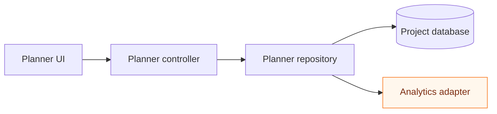
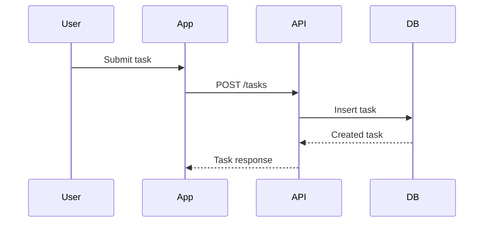
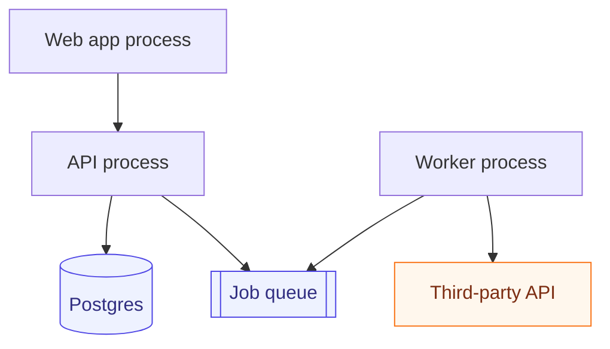
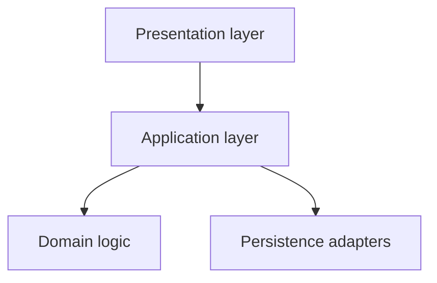
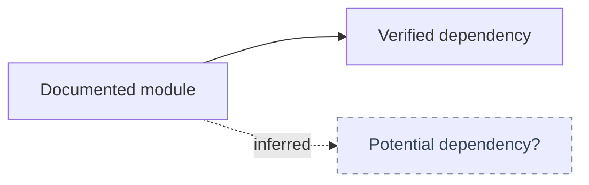

# Diagram Patterns

Use this reference when choosing how to represent a source-grounded architecture map. Mermaid is the default source of truth. Other visual formats are secondary and should derive from the same evidence.

## Map Types

### Module Or Dependency Map

Use when showing major modules, packages, feature slices, adapters, or dependency direction.



Evidence to cite:

- package or folder entrypoints;
- import statements;
- route or provider registration;
- repository, adapter, or client wiring;
- tests that exercise the relationship.

### Flow Or Sequence Map

Use when the architecture is best understood as ordered behavior: request handling, async work, jobs, events, workflows, or cross-system calls.



Evidence to cite:

- route handlers, controllers, jobs, queues, or event listeners;
- API docs, OpenAPI specs, or RPC definitions;
- tests or fixtures for the flow;
- logs or runbooks only when they are project-approved evidence.

### Runtime Topology Map

Use when showing deployed units, processes, storage, queues, third-party integrations, scheduled jobs, or infrastructure.



Evidence to cite:

- deployment manifests, Dockerfiles, service configs, CI/CD, hosting docs;
- environment variable docs;
- queue, worker, scheduler, or infrastructure definitions;
- runbooks or architecture docs.

### Layered Map

Use when the architecture is intentionally organized by layers or tiers.



Evidence to cite:

- documented layering rules;
- module naming conventions;
- import direction checks;
- representative source files.

Do not infer layering from directory names alone.

## Legends And Markers

Include a legend when the diagram uses visual conventions beyond plain nodes and arrows.

Suggested conventions:

- Solid arrow: verified relationship.
- Dashed arrow: inferred or weakly evidenced relationship.
- Orange node: external system or third-party integration.
- Blue node: datastore, queue, file store, or durable state.
- Thick border or label: seam or adapter point, only when source evidence supports it.
- `?` suffix: uncertain node or relationship.

Example:



Every marker must be explained near the diagram and reflected in the source-reference table.

## Source Reference Table

Use one row per meaningful diagram claim. Group tiny claims only when they share the same source and confidence.

```markdown
| Diagram item | Evidence | Confidence | Notes |
| --- | --- | --- | --- |
| `Planner UI -> Planner controller` | `lib/features/planner/planner_page.dart`; `planner_controller.dart` | High | Verified by provider usage and controller import. |
| `Worker process -> Third-party API` | `docs/runbooks/jobs.md`; `src/jobs/sync.ts` | Medium | Runtime scheduling not verified in this pass. |
| `Billing adapter` | `src/billing/stripe_client.ts` | Low | Adapter role inferred from name and usage; no docs found. |
```

Confidence levels:

- `High`: verified by direct source evidence or explicit durable docs.
- `Medium`: supported by multiple weak signals or one strong source with a small gap.
- `Low`: plausible but incomplete, stale, inferred, or not fully traced.

## Optional Formats

Use optional formats only when they add value and are available in the current agent environment.

- ASCII: useful for terminal-only output or tiny maps.
- Excalidraw: useful for editable whiteboard-style collaboration.
- Generated image: useful for presentation or visual review, but should be derived from a source-grounded map.
- HTML: useful for rich reports, but should not replace the Mermaid source unless the user asks.
- Plugin-backed diagrams: useful when an installed tool can preserve editability or team workflow.

When using an optional format, keep the Mermaid diagram or a clear textual source map as the auditable source of truth.

## Anti-Patterns

- Decorative diagrams with no source references.
- Diagrams that show desired future architecture as if it exists.
- Before/after refactor proposals; route those to architecture improvement workflows.
- Exhaustive file inventories disguised as architecture maps.
- Dense diagrams that need a long essay to be understood.
- Claims based only on common framework habits rather than target-project evidence.
